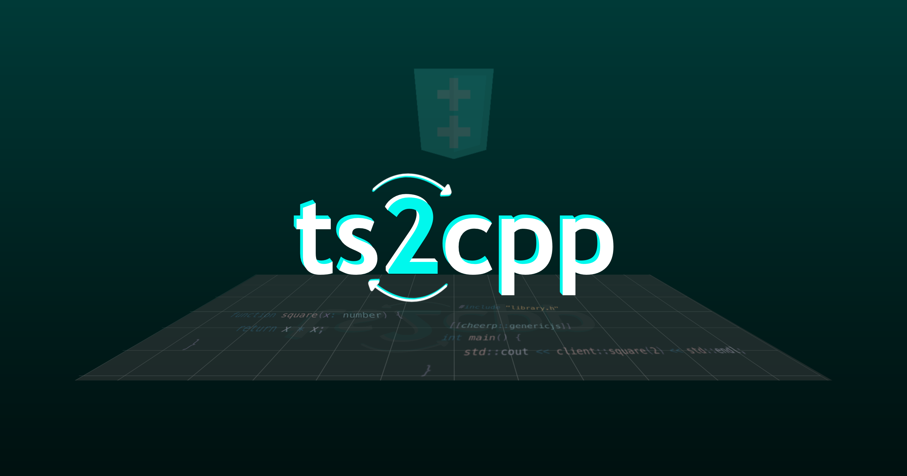

A tool to generate C++ headers from typescript declaration files (.d.ts) for use with [Cheerp](https://github.com/leaningtech/cheerp-meta).

```
Usage: ts2cpp [options]

Options:
  --pretty                 format output files
  --default-lib            generate headers for the default library
  --out, -o <file>         path to output file
  --ignore-errors          ignore errors
  --list-files             write a list of all included .d.ts files
  --verbose, -v            verbose output
  --verbose-progress       verbose progress
  --namespace <namespace>  wrap output in a namespace
  --no-constraints         do not use std::enable_if or static_asserts
  --full-names             always use fully qualified names
  -h, --help               display help for command
```

## Setup

```
git clone https://github.com/leaningtech/ts2cpp.git
cd ts2cpp
npm i && npx tsc
```

Or run with `npx`:

```
npx @leaningtech/ts2cpp --help
```

## Examples

Generating clientlib headers

```
mkdir -p cheerp
npx ts2cpp --default-lib --pretty
```

Generating headers from a custom declaration file

```
npx ts2cpp --pretty test.d.ts -o test.h
```
